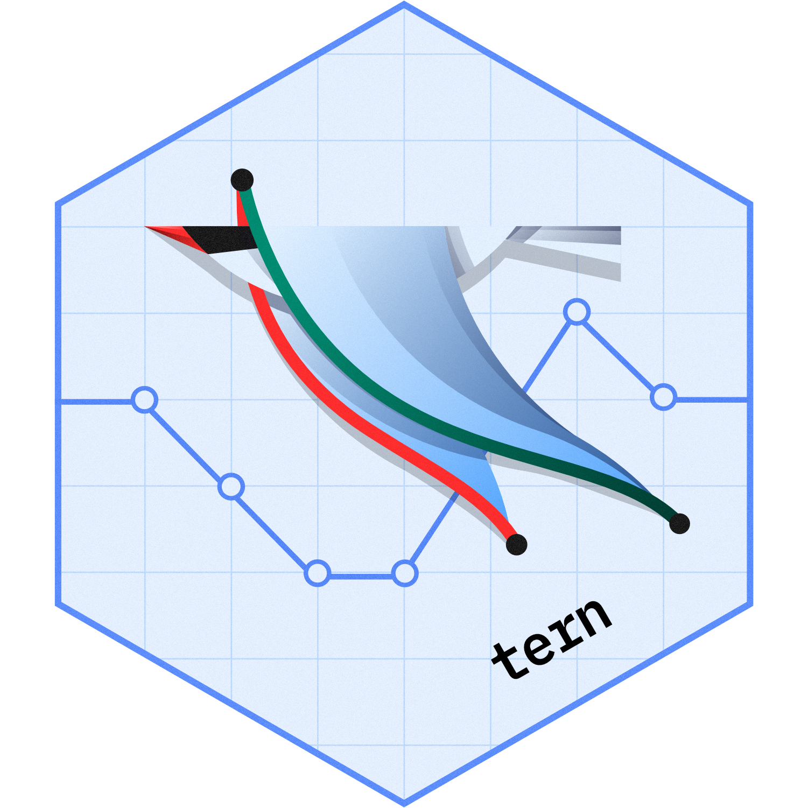

# tern <a href='https://github.com/insightsengineering/tern'></a>

The `tern` R package contains analysis functions to create tables and graphs used for clinical trial reporting.

The package provides a large range of functionality, for example:
- data visualizations:
  * forest plots
  * line plots
  * Kaplan-Meier plots
  * ...
- statistical model fits:
  * MMRM
  * logistic regression
  * Cox regression
  * ...
- summary tables:
  * unique patients
  * exposure across patients
  * change from baseline for parameters
  * ...


Many of these outputs are available to be added into `teal` applications for interactive exploration of data. These `teal` modules are available in the [`teal.modules.clinical`](https://github.com/insightsengineering/teal.modules.clinical) package.

## Installation

This repository requires a personal access token to install see here [creating and using PAT](https://docs.github.com/en/github/authenticating-to-github/keeping-your-account-and-data-secure/creating-a-personal-access-token). Once this is set up, to install the latest released version of the package run:

```r
Sys.setenv(GITHUB_PAT = "your_access_token_here")
if (!require("devtools")) install.packages("devtools")
devtools::install_github("insightsengineering/tern@*release", dependencies = FALSE)
```

You might need to manually install all of the package dependencies before installing this package as without
the `dependencies = FALSE` argument to `install_github` it may produce an error.

In order to run many of the examples you will also need to install the [`scda`](https://github.com/insightsengineering/scda) package.

See package vignettes `browseVignettes(package = "tern")` for usage of this package.

## Acknowledgments

There are a number of people who have previously been actively working on `tern` including: Maximilian Mordig, Jennifer Li, Chendi Liao, Yuyao Song, Edgar Manukyan, Carolyn Zhang, Mark Rothe, Xiao Yu Mo.
