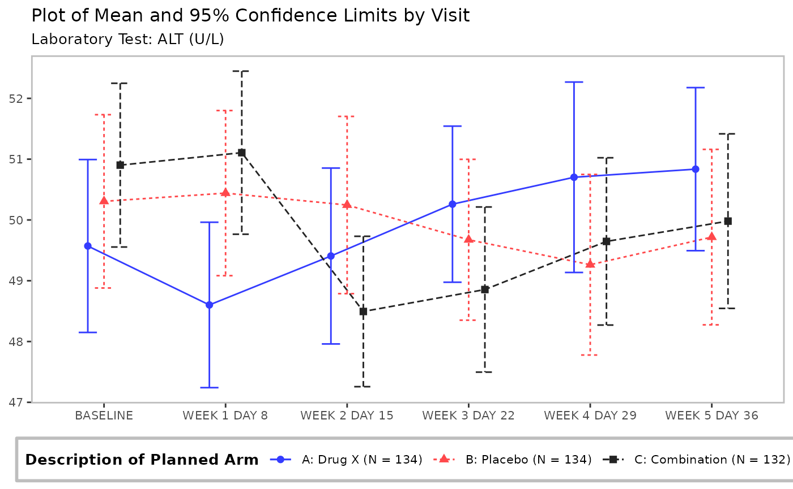
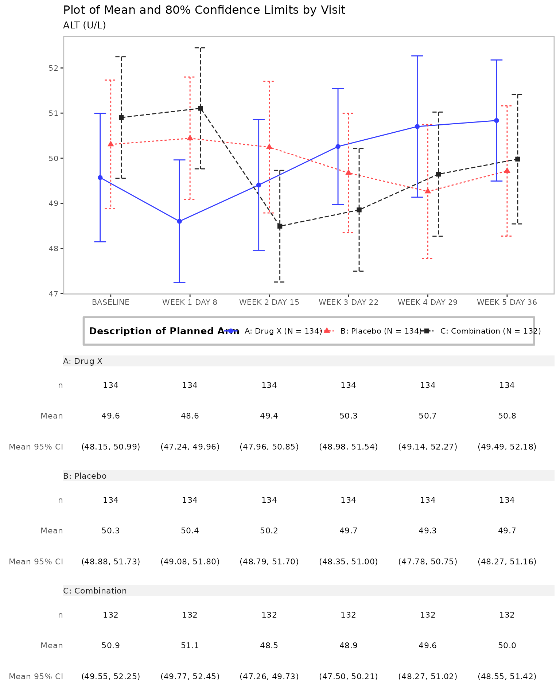

# Introduction to tern

This vignette shows the general purpose and syntax of the `tern` R
package. The `tern` R package contains analytical functions for creating
tables and graphs useful for clinical trials and other statistical
analysis. The main focus is on the clinical trial reporting tables but
the graphs related to the clinical trials are also valuable. The core
functionality for tabulation is built on top of the more general purpose
`rtables` package.

[**It is strongly recommended that you start by reading the
“Introduction to `rtables`” vignette to get familiar with the concept of
`rtables`.**](https://insightsengineering.github.io/rtables/latest-tag/articles/rtables.html)

------------------------------------------------------------------------

## Common Clinical Trials Analyses

The package provides a large range of functionality to create tables and
graphs used for clinical trial and other statistical analysis.

`rtables` tabulation extended by clinical trials specific functions:

- demographics
- unique patients
- exposure across patients
- change from baseline for parameters
- statistical model fits: MMRM, logistic regression, Cox regression, …
- …

`rtables` tabulation helper functions:

- pre-processing
- conversions and transformations
- …

data visualizations connected with clinical trials:

- Kaplan-Meier plots
- forest plots
- line plots
- …

data visualizations helper functions:

- arrange/stack multiple graphs
- embellishing graphs/tables with metadata and details, such as adding
  titles, footnotes, page number, etc.
- …

The reference of `tern` functions is available on [the tern website
functions
reference](https://insightsengineering.github.io/tern/latest-tag/reference/index.html).

------------------------------------------------------------------------

## Analytical Functions for `rtables`

Analytical functions are used in combination with other `rtables` layout
functions, in the pipeline which creates the `rtables` table. They apply
some statistical logic to the layout of the `rtables` table. The table
layout is materialized with the
[`rtables::build_table`](https://insightsengineering.github.io/rtables/latest-tag/reference/build_table.html)
function and the data.

The `tern` analytical functions are wrappers around the
[`rtables::analyze`](https://insightsengineering.github.io/rtables/latest-tag/reference/analyze.html)
function; they offer various methods useful from the perspective of
clinical trials and other statistical projects.

Examples of the `tern` analytical functions are `count_occurrences`,
`summarize_ancova` and `analyze_vars`. As there is no one prefix to
identify all `tern` analytical functions it is recommended to use the
reference subsection on [the tern
website](https://insightsengineering.github.io/tern/latest-tag/reference/index.html).

In the `rtables` code below we first describe the two tables and assign
the descriptions to the variables `lyt` and `lyt2`. We then built the
tables using the actual data with
[`rtables::build_table`](https://insightsengineering.github.io/rtables/latest-tag/reference/build_table.html).
The description of a table is called a table **layout**. The **analyze
instruction** adds to the layout that the `ARM` variable should be
analyzed with the `mean` analysis function and the result should be
rounded to 1 decimal place. Hence, a **layout** is “pre-data”; that is,
it’s a description of **how to build a table once we get data**.

``` r
library(tern)
library(dplyr)
```

Defining the table layout with a pure `rtables` code:

``` r
# Create table layout pure rtables
lyt <- rtables::basic_table() %>%
  rtables::split_cols_by(var = "ARM") %>%
  rtables::split_rows_by(var = "AVISIT") %>%
  rtables::analyze(vars = "AVAL", mean, format = "xx.x")
```

Below, the only `tern` function used is `analyze_vars` which replaces
the
[`rtables::analyze`](https://insightsengineering.github.io/rtables/latest-tag/reference/analyze.html)
function used above.

``` r
# Create table layout with tern analyze_vars analyze function
lyt2 <- rtables::basic_table() %>%
  rtables::split_cols_by(var = "ARM") %>%
  rtables::split_rows_by(var = "AVISIT") %>%
  analyze_vars(vars = "AVAL", .formats = c("mean_sd" = "(xx.xx, xx.xx)"))
```

``` r
# Apply table layout to data and produce `rtables` object

adrs <- formatters::ex_adrs

rtables::build_table(lyt, df = adrs)
#>                    A: Drug X   B: Placebo   C: Combination
#> ——————————————————————————————————————————————————————————
#> SCREENING                                                 
#>   mean                3.0         3.0            3.0      
#> BASELINE                                                  
#>   mean                2.5         2.8            2.5      
#> END OF INDUCTION                                          
#>   mean                1.7         2.1            1.6      
#> FOLLOW UP                                                 
#>   mean                2.2         2.9            2.0
rtables::build_table(lyt2, df = adrs)
#>                     A: Drug X      B: Placebo    C: Combination
#> ———————————————————————————————————————————————————————————————
#> SCREENING                                                      
#>   n                    154            178             144      
#>   Mean (SD)        (3.00, 0.00)   (3.00, 0.00)    (3.00, 0.00) 
#>   Median               3.0            3.0             3.0      
#>   Min - Max         3.0 - 3.0      3.0 - 3.0       3.0 - 3.0   
#> BASELINE                                                       
#>   n                    136            146             124      
#>   Mean (SD)        (2.46, 0.88)   (2.77, 1.00)    (2.46, 1.08) 
#>   Median               3.0            3.0             3.0      
#>   Min - Max         1.0 - 4.0      1.0 - 5.0       1.0 - 5.0   
#> END OF INDUCTION                                               
#>   n                    218            205             217      
#>   Mean (SD)        (1.75, 0.90)   (2.14, 1.28)    (1.65, 1.06) 
#>   Median               2.0            2.0             1.0      
#>   Min - Max         1.0 - 4.0      1.0 - 5.0       1.0 - 5.0   
#> FOLLOW UP                                                      
#>   n                    164            153             167      
#>   Mean (SD)        (2.23, 1.26)   (2.89, 1.29)    (1.97, 1.01) 
#>   Median               2.0            4.0             2.0      
#>   Min - Max         1.0 - 4.0      1.0 - 4.0       1.0 - 4.0
```

We see that `tern` offers advanced analysis by extending `rtables`
function calls with only one additional function call.

**More examples with tabulation analyze functions are presented in the
`Tabulation` vignette.**

## Clinical Trial Visualizations

Clinical trial related plots complement the rich palette of `tern`
tabulation analysis functions. Thus the `tern` package delivers a
full-featured tool for clinical trial reporting. The `tern` plot
functions return graphs as `ggplot2` objects.

``` r
adsl <- formatters::ex_adsl
adlb <- formatters::ex_adlb
adlb <- dplyr::filter(adlb, PARAMCD == "ALT", AVISIT != "SCREENING")
```

The `nestcolor` package can be loaded in to apply the standardized NEST
color palette to all `tern` plots.

``` r
library(nestcolor)
```

Line plot without a table generated by the `g_lineplot` function.

``` r
# Mean with CI
g_lineplot(adlb, adsl, subtitle = "Laboratory Test:")
```



Line plot with a table generated by the `g_lineplot` function.

``` r
# Mean with CI, table, and customized confidence level
g_lineplot(
  adlb,
  adsl,
  table = c("n", "mean", "mean_ci"),
  title = "Plot of Mean and 80% Confidence Limits by Visit"
)
```



All `tern` functions used for plot generation are `g_` prefixed and are
listed on [the tern website functions
reference](https://insightsengineering.github.io/tern/latest-tag/reference/index.html#graphs).

## Interactive Apps

Most `tern` outputs can be easily converted into `shiny` apps. We
recommend building apps using the [`teal`
package](https://insightsengineering.github.io/teal/latest-tag/), a
shiny-based interactive exploration framework for analyzing data. A
variety of pre-made `teal` shiny apps for `tern` outputs are available
in the [`teal.modules.clinical`
package](https://insightsengineering.github.io/teal.modules.clinical/latest-tag/).

## Summary

In summary, `tern` contains many additional functions for creating
tables, listings, and graphs used in clinical trials and other
statistical analyses. The design of the package gives users the
flexibility to meet the analysis needs in both regulatory and
exploratory reporting contexts.

**For more information please explore [the tern
website](https://insightsengineering.github.io/tern/latest-tag/).**
